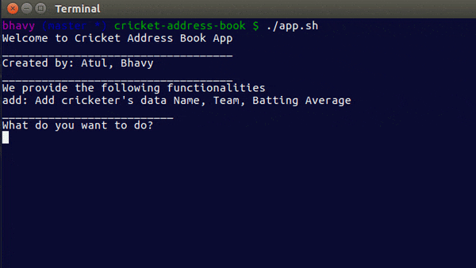

___
- Run the app using `./app.sh` command.
- Web scraping is done through cricinfo website where players name, team and odi average were scraped. Scraped data is stored in `player_stats_scraped.txt` file

----
App contains the following functionality
1. Adding Data:
  - Name, team, batting average
  - If the name is duplicating a name already in the address book, you will be prompt to replace old information with new
2. Searching Data:
  - By name or team
  - Displaying all relevant records
3. Removing Data
  - After search returns a record, you get an  option to remove it
----

### Demo

  
