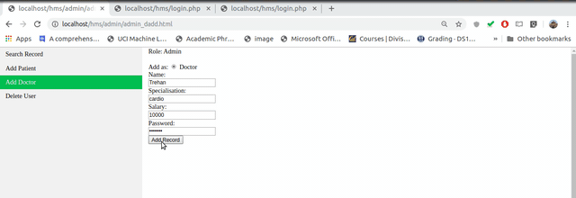

**Setup**

`CREATE DATABASE hospital;`

`USE hospital;`

```
create table if not exists doctor(
  did INT auto_increment primary key,
  name text not null,
  spl text,
  salary int
  ) engine = innodb;```

```
create table if not exists patient(
  pid INT auto_increment primary key,
  name text not null,
  disease text,
  status text,
  did int,
  payment int
  ) engine = innodb;
```

`create user 'admin'@'localhost' identified by '12345678';`

`grant all on hospital to 'admin'@'localhost';`

`grant all on hospital.* to 'admin'@'localhost';`

**Hospital Management System**

Aim for hospital dbms is to provide  both patients and doctors easily accessible information such as

-Who are the patients assigned to doctor? (rel to doctor)

-When is doctor freely available?(rel to patient)

-How many patients come each day to hospital? (rel to manager/admin)

**Guidelines**

Designing a dbms is a complex and hard process which involve following steps

1. Requirement Analysis: Stating the problem statement clearly i.e.

  - why is going to be stored i.e. which entities you are going to store, what is relationship between them etc.
  - What are we going to do with the data i.e. provide info to which entities
  - Who is going to access the data

2. ER Modelling: Next step is modelling the dbms based on the requirements. There are various models available but one of the famous one is ER modelling which involves defining entities and relationship between them.

**Specifications**

1. We want to store details of patients
  - Name,
  - Date of birth,
  - Disease
  - Doctor Referred to
  - Current Status: admit, icu, normal etc.
  - Price to pay
2. Details of doctor
  - Specialisation
  - Dob
  - Place residence
  - Free Time
  - Patients currently under diagonosis
  - Salary
  - Free time

**Specifications**
  - Patient cann’t access doctor’s personal information other than specialisation.
  - Doctor has access to patient’s detail other than price to pay.
  - Admin can access to each and every detail of both patient and doctor.
  - Only admin can insert and update doctor as well as patient’s entry.
  - One patient can be referred to only one doctor at a time.
  - Doctor can diagnos more than one patients.
  - Doctor will diagnos patient only if disease comes under his/her specialization.
  - Every patient must be assigned to some doctor.
  - Sign up option is provided only by admin, doctor and patients are only able to login.
  - After log in doctor and patients have the option to update their records except disease date of birth doctor referred to and other options.
  - Patient should be assigned to only that doctor which exist in the database.
  - Doctor can see only those patient’s record which are assigned to him.

## More details about project

1. What you did?

  a. We started with the idea of having 3 roles in our dbms namely
  - Admin
  - Patient
  - Doctor

  b. The idea of having different roles was the security and isolation of data that is three in database. For e.g. patient A must not be able to change or view the personal details/password of other patient or doctor.

  c. Admin: Admin was the highest priviliged role in our dbms, which has access to following operations

    -Adding new patient/doctor in database along with their password. We don’t want that patient/doctor should themselves be able to create their record due to some constraints like salary. Although in this simple dbms we have also provided password access to admin in further improvements this can be changed.

    - Searching for patient and doctor record based on their names and topmost no of entries
    - Deleting a user

  d.  After creating a user account, now user can access his/her records through login page.

  e. Login Page: Three options are available role, user name and password. Sanity checking is also done for the security purpose for e.g. user cann’t pass some sql command from the username form to the server which can breach the security. Also whenever a username/password is wrong suitable alert prompt appear on the screen notifying user to provide correct one.

  f. Patient: On successful login, patient is able to see his personal details and doctor he has been assigned to. But he doesn’t has permission to change any of these records. In future work, we can provide him higher level access to change some of the entries like address, name, age, etc.

  g. Doctor: On successful login, doctor is able to see his personal details such as salary and patients that are assigned to him. Although no option for filtering records of patients has been provided but that is a very easy extension to be implemented.

2.How you did?
  - For the client server based web services, lamp stack is used. The workflow is simple to understand at the higher level. Client will send the request to server, for e.g. searching for a particular record. At the server it will search according to request and send the result back to client.
  - For asking queries on the database mysql is used, the result is then processed using php. PHP also used to receive and send the request back to client. Client sends the request to server using forms.
  - Workflow for login page is as follows: First it receives the request(get/post) from client which has all the form variables store i.e. role, username and password. Based on the username it search for the username and password match in the database and if it matches then it sends it to the logged in page based on the role. The user’s information is stored in session variables.
  - For other pages workflow is similar, first php will make a conection with sql based on username and password which were received by post request and then accesses are granted based on the role. After that query can be asked to database using that connection.


## Demo

